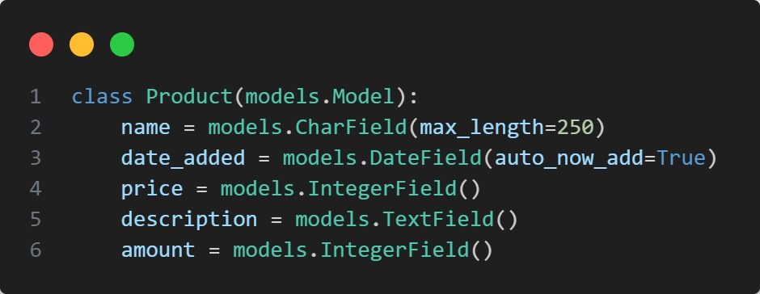
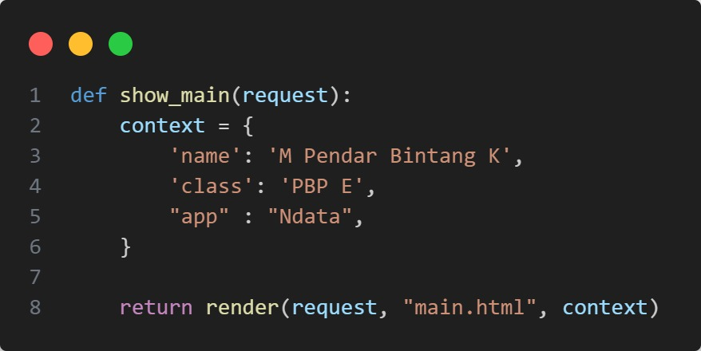

# Ndata
## Tugas 2 PBP Ganjil 23/24

Checklist untuk tugas ini adalah sebagai berikut.

- [X] Membuat sebuah proyek Django baru.
- [x] Membuat aplikasi dengan nama main pada proyek tersebut.
- [x] Melakukan routing pada proyek agar dapat menjalankan aplikasi main.
- [x] Membuat model pada aplikasi main dengan nama Item dan memiliki atribut wajib sebagai berikut.
		name sebagai nama item dengan tipe CharField.
		amount sebagai jumlah item dengan tipe IntegerField.
		description sebagai deskripsi item dengan tipe TextField.
- [X] Membuat sebuah fungsi pada views.py untuk dikembalikan ke dalam sebuah template HTML yang menampilkan nama aplikasi serta nama dan kelas kamu.
- [X] Membuat sebuah routing pada urls.py aplikasi main untuk memetakan fungsi yang telah dibuat pada views.py.
- [X] Melakukan deployment ke Adaptable terhadap aplikasi yang sudah dibuat sehingga nantinya dapat diakses oleh teman-temanmu melalui Internet.
- [X] Membuat sebuah README.md yang berisi tautan menuju aplikasi Adaptable yang sudah di-deploy, serta jawaban dari beberapa pertanyaan berikut.

Tautan menuju link adaptable yang telah di deploy [Ndata](https://ndata.adaptable.app/)

## Pertanyaan dan jawaban
**Jelaskan bagaimana cara kamu mengimplementasikan checklist di atas secara step-by-step (bukan hanya sekadar mengikuti tutorial).**
**Membuat sebuah proyek Django baru**
1. Membuat sebuah Git dan Direktori lokal dengan nama ```Ndata``` 
2. Membuat virtual environment (venv) python untuk mengisolasi python yang digunakan pada proyek ini, mengaktifkan venv dengan memasukkan ```env\Scripts\activate.bat``` pada cmd di direkotori ```Ndata```
3. Membuat file ```requirements.txt``` yang berisi *depedencies* yang dibutuhkan pada proyek ini
4. Install *Depedencies* tadi dengan ```pip intall -r requirements.txt```, lalu membuat proyek django dengan ```django-admin startproject Ndata``` 
5. Membuka ```settings.py```, pada ```ALLOWED_HOST``` jadikan ```["*"]```
6. Mengecek apakah django sudah benar terinstall dengan ```python manage.py runserver```, lalu membuka http://localhost:8000. Jika tidak memunculkan error, maka proyek django berhasil 
7. Nonaktifkan server dengan ```CTRL + C``` dan matikan venv dengan ```deactivate```

**Membuat aplikasi dengan nama main pada proyek tersebut.**
1. Masuk kembali ke mode venv dengan  ```env\Scripts\activate.bat```
2. jalankan ```python manage.py startapp main``` untuk membuat folder baru bernama ```main```
3. pada ```settings.py```, menambahkan ```main``` pada ```INSTALLED APPS```

**Melakukan routing pada urls.py di main.**
1. Membuat file ```urls.py``` pada direktori ```main``` 
2. menambahkan kode ini pada ```urls.py```


**Membuat model pada aplikasi main dengan nama Item dan atribut.**
1. Buka file ```models.py``` pada ```main```
2. Import ```from django.db import models```
3. lalu tambahkan 
4. lakukan migrasi model dengan ```python manage.py make migrations```, setelahnya lakukan ```python manage.py migrate```

**Membuat sebuah fungsi pada views.py untuk dikembalikan ke dalam sebuah template HTML**
1. Buka file ```views.py``` pada ```main```
2. Import ```from django.shortcuts import render```
3. Lalu tambahkan 

**Melakukan routing pada urls.py di folder utama proyek.**
1. Membuka file ```urls.py``` pada direktori ```Ndata``` 
2. Menambahkan import ```include ``` dari ```django.urls```
3. pada ```urlspatterns``` menambahkan ```path('main/',include('main.urls')),```.

**Melakukan deployment ke Adaptable**
1. Login adaptable.io menggunakan github, lalu pilih "New App" dan "Connect an Existing Repository" kemudia pilih "All Repository".
2. Pilih repository Ndata, lalu gunakan branch main untuk *deployment*
3. Gunakan template "Python App Template"  dan "PostgreSQL" sebagai basis datanya
4. Sesuaikan Versi python (gunakan python --version di cmd untuk mengcek versi yang digunakan)
5. Mengisi start command dengan ```python manage.py migrate && gunicorn Ndata.wsgi```.
7. Tentukan nama aplikasi yang akan menjadi domain *website*
8. Centang "HTTP Listener on PORT" dan klik "Deploy App" untuk memulai proses deploy aplikasi

**Buatlah bagan yang berisi request client ke web aplikasi berbasis Django beserta responnya dan jelaskan pada bagan tersebut kaitan antara urls.py, views.py, models.py, dan berkas html.**

Di web app yang berbasi Django, saat client mengirimkan permintaan HTTP, Django akan menggunakan ```urls.py``` untuk mencari dan menentukan views yang sesuai. pada ```views.py``` akan mengatur logika app, termasuk bagaimana app berinteraksi dengan model yang ada pada ```models.py``` untuk mengakses dan menggunakan data pada database. Data yang diperlukan akan dikumpulkan pada views, dan hasilnya akan dirender pada file HTML. file HTML akan mengandung kode HTML dan juga tag template Django untuk memasukkan data yang berasal dari views. setelah proses tersebut selesai, webpage tadi akan dikirim sebagai respon ke client.
```urls.py``` = mengelola routing
```views.py``` = mengatur logika
```models.py``` = mengelola data
```template``` = mengatur tampilan

### **Jelaskan mengapa kita menggunakan virtual environment? Apakah kita tetap dapat membuat aplikasi web berbasis Django tanpa menggunakan virtual environment?**

Virtual Environment (venv) adalah sebuah modul yang membantu memisahkan depedencies yang diperlukan suatu proyek yang berbeda dengan membuat Virtual Environment python yang terisolasi dari Base Environment. 

Kita menggunakan virtual environment untuk memisahkan dan mengisolasi *depedencies* yang digunakan pada proyek ini dari base environment python yang akan menghindari terjadinya konflik saat mengerjakan berbagai projek yang memiliki *depedencies* yang berbeda. Ketika ada perbedaan versi python ketika proyek dikerjakan oleh orang yang berbeda, proyek tetap dapat berjalan dengan aman karena konfigurasi virtual environment yang digunakan akan memiliki versi python yang sama

### **Jelaskan apakah itu MVC, MVT, MVVM dan perbedaan dari ketiganya.**
MVC (Model-View-Controller), MVT (Model-View-Template), dan MVVM (Model-View-ViewModel) adalah pola arsitektur perangkat lunak yang sering digunakan dalam proses pengembangan aplikasi untuk memisahkan berbagai komponen aplikasi dan membuatnya lebih terstruktur dan tidak terjadi konflik antar komponen. Pada dasarnya mereka memiliki konsep yang tidak jauh berbeda, namun penggunaan mereka memiliki konteks dan cara pengorganisasian komponen-komponennya.

**Model View Controller (MVC)**
|Model|View|Controller|
|---|---|---|
|Komponen yang mengatur data pada aplikasi. Komponen inilah yang mengurus akses dan manipulasi data, baik dari suatu database atau sumber lainnya. selain itu Model juga menentukan logika yang dimiliki aplikasi, seperti perhitungan dan validasi data.|komponen yang menangani tampilan yang dilihat oleh pengguna saat berinteraksi dengan aplikasi. komponen ini bertugas mengambil data dari Model dan ke tampilan.|Komponen yang mengatur hubungan Model dan View. komponen ini menangani permintaan pengguna, lalu memprosesnya, dan akan mengirimkannya ke Model untuk memperbarui atau mengambil data yang diperlukan.|

**Model View Template (MVT)**
|Model|View|Template|
|---|---|---|
|Sama seperti Model pada MVC, Komponen inilah yang mengatur data pada aplikasi dan menentukan logika yang digunakan aplikasi.|Komponen yang mengatur logika tampilan pada konsep MVT, mengontrol data yang berasal dari Model untuk ditampilkan ke user.|Komponen yang bertanggung jawab untuk mengatur tampilan pengguna, template pada django digunakan sebagai tempat merancang tampilan yang akan ditampilkan pada halaman web yang menggabungkan data dari Model agar dapat dilihat pengguna.|

**Model View ViewModel (ViewModel)**
|Model|View|ViewModel|
|---|---|---|
|Sama seperti Model pada MVC, dan MVT. Nantinya Model dan ViewModel pada MVVM.|Komponen yang bertanggung jawab untuk menampilkan tampilan dan memberi tahu ViewModel tentang tindakan pengguna. View pada MVVM berfungsi sebagai penampil yang pasif yang hanya menampilkan data dan tidak ada logika aplikasi.|Komponen yang bertindak sebagai penghubung antara Model dan View. ViewModel mengubah data yang berasdal dari Model menjadi format yang dapat ditampilkan oleh View dan juga mengatur logika tampilan.|

**Perbedaan MVC, MVT, dan MVVM**

**MVC**
MVC adalah pola desain yang diatur agar digunakan dalam perkembangan berbagai jenis aplikasi di berbagai platform. Pada MVC, Controller memiliki peran yang aktif dalam mengatur Model dan View. MVC terfokus pada pemisahan tugas pada Model yang mengelola data dan logika, View yang mengurus tampilan, dan Controller yang mengatur jalannya MVC, developer harus sering mengelola secara manual pembaruan tampilan setiap kali ada perubahan data.

**MVT**
MVT adalah konsep yang sering digunakan dalam pengembangan web dengan Django yang berbasis Python. Salah satu komponen uniknya adalah Template (Django), yang dikhususkan untuk mengatur tampilan pada halaman web, sedangkan Model dan View sama seperti pada MVC. *framework* ini memiliki alat bawaan untuk mengurus pembaruan tampilan secara otomatis ketika ada perubahan data

**MVVM**
MVVM sering digunakan dalam pengembangan aplikasi yang berbasis *User Interface*(UI), seperti app mobile ataupun desktop. MVVM memiliki fokus untuk memisahkan tugas tampilan dan logika dalam UI, ViewModel bertindak sebagai penghubung antara Model dan View memungkinkan keduanya untuk tetap terpisah dan mengurangi ketergantungan antara keduanya. MVVM mengandalkan sistem pengikatan data (*Data Binding*) untuk secara otomatis memperbarui tampilan ketika ada perubahan pada ViewModel, ini akan mengurangi kode boilerplate yang diperlukan untuk pemabruan tampilan, tetapi jika sistem pengikatan data tersebut sangat kompleks, akan sulit untuk melakukan *debugging* 

# Tugas 3 PBP Ganjil 23/24

 - [x] Membuat input form untuk menambahkan objek model pada app sebelumnya.
 - [x] Tambahkan 5 fungsi views untuk melihat objek yang sudah ditambahkan dalam format HTML, XML, JSON, XML by ID, dan JSON by ID.
 - [x] Membuat routing URL untuk masing-masing views yang telah ditambahkan pada poin 2.
 - [X] Menjawab beberapa pertanyaan berikut pada README.md pada root folder.
	* Apa perbedaan antara form POST dan form GET dalam Django?
	* Apa perbedaan utama antara XML, JSON, dan HTML dalam konteks pengiriman data?
	* Mengapa JSON sering digunakan dalam pertukaran data antara aplikasi web modern?
	* Jelaskan bagaimana cara kamu mengimplementasikan checklist di atas secara step-by-step (bukan hanya sekadar mengikuti tutorial).
- [x] Mengakses kelima URL di poin 2 menggunakan Postman, membuat screenshot dari hasil akses URL pada Postman, dan menambahkannya ke dalam README.md.
- [x] Melakukan add-commit-push ke GitHub.

## **Membuat Input Form untuk menambahkan objek model pada app sebelumnya** 
1. Membuat folder ```templates``` pada root folder, kemudian buat file html ```base.html``` dengan isi
```html

<!DOCTYPE html>
<html lang="en">
    <head>
        <meta charset="UTF-8" />
        <meta
            name="viewport"
            content="width=device-width, initial-scale=1.0"
        />
        
        
    </head>

    <body>
        
        
    </body>
</html>
```

2. Pada ```settings.py``` yang ada pada subdirektori ```Ndata```, pada variabel ```TEMPLATES``` lalu sesuakian kode pada bagian ```DIRS``` menjadi
```py
TEMPLATES = [
    {
        ...
        'DIRS': [BASE_DIR / 'templates'],
        ...
    }
]
```

3. Pada ```main.html``` yang berada pada subdirektori ```templates``` yang berada di dalam direktori ```main```, tambahkan kode
```html


    ...
    //kode html sebelumnya
    ...

```

4. Lalu nyalakan virtual environment dengan ```env\Scripts\activate.bat```

5. Membuat file ```forms.py``` pada direktori ```main``` yang berisi struktur form yang dapat menerima data
```py
from django.forms import ModelForm
from main.models import Product

class ProductForm(ModelForm):
    class Meta:
        model = Product
		fields = ["name", "price", "description"]
```

6. Pada file ```views.py``` pada direktori ```main```, tambahkan beberapa input baru serta buat fungsi ```create_product``` agar data pada form bisa menambahkan data secara otomatis
```py
from django.http import HttpResponseRedirect
from main.forms import ProductForm, Product
from django.urls import reverse
...
def create_product(request):
    form = ProductForm(request.POST or None)

    if form.is_valid() and request.method == "POST":
        form.save()
        return HttpResponseRedirect(reverse('main:show_main'))

    context = {'form': form}
    return render(request, "create_product.html", context)
```


## **Tambahkan 5 fungsi views untuk melihat objek yang sudah ditambahkan dalam format HTML, XML, JSON, XML by ID, dan JSON by ID.**

### **HTML**
1. Pada file ```views.py``` ubah fungsi ```show_main``` menjadi 
```py
def show_main(request):
    products = Product.objects.all()

    context = {
        'name': 'M Pendar Bintang K',
        'class': 'PBP E',
        "app" : "Ndata",
        'npm' : '2206083174',
        'products' : products
    }

    return render(request, "main.html", context)
```
2. Buat file ```create_product.html``` pada folder ```templates``` yang berada di dalam direktori ```main```, fungsi dari file ini adalah menampilkan tampilan form untuk meminta input data
```html
 


<h1>Add New Product</h1>

<form method="POST">
    
    <table>
        {{ form.as_table }}
        <tr>
            <td></td>
            <td>
                <input type="submit" value="Add Product"/>
            </td>
        </tr>
    </table>
</form>


```

3. Pada file ```urls.py``` yang berada di dalam direktori ```main``` tambahkan import ```create_product``` dan tambahkan path url di urlpattern
```py
from main.views import show_main, create_product
...
urlpatterns = [
    ...
    path('create-product', create_product, name='create_product'),
]
``` 

4.  Pada ```main.html``` yang berada pada subdirektori ```templates``` yang berada di dalam direktori main, tambahkan kode di dalam `````` agar bisa menampilkan isi barang yang sudah ditambahkan.
```html
...
<table>
	<tr>
		<th>Name</th>
		<th>Price</th>
		<th>Description</th>
		<th>Date Added</th>
	</tr>

	
		<tr>
			<td>{{product.name}}</td>
			<td>{{product.price}}</td>
			<td>{{product.description}}</td>
			<td>{{product.date_added}}</td>
		</tr>
	
</table>

<h3>Kamu menyimpan {{ total_products }} productsproducts pada aplikasi ini</h3>

<br />

<a href="">
	<button>
		Add New Product
	</button>
</a>
...
```
## **Membuat routing URL untuk masing-masing views yang telah ditambahkan pada poin 2.**
### **XML dan JSON**
1. Buka file ```views.py``` pada direktori ```main```, lalu import ```HttpResponse``` dan ```Serializer```, lalu tambahkan fungsi ```show_xml``` dan ```show_json```
```py
from django.http import HttpResponseRedirect, HttpResponse
from django.core import serializers
***
def show_xml(request):
    data = Product.objects.all()
    return HttpResponse(serializers.serialize("xml", data), content_type="application/xml")

def show_json(request):
    data = Product.objects.all()
    return HttpResponse(serializers.serialize("json", data), content_type="application/json")

***

```
2. Buka file ```urls.py``` pada direktori ```main```, import fungsi ```show_xml``` dan ```show_json``` dan tambahkan routing url ke urlpatterns
```py
from main.views import show_main, create_product, show_json, show_xml,
...
urlpatterns = [
	...
    path('xml/', show_xml, name='show_xml'), 
    path('json/', show_json, name='show_json'), 
]
```
### **XML dan JSON by ID**
1. Buka file ```views.py``` pada direktori ```main```, lalu tambahkan fungsi ```show_xml_by_id``` dan ```show_json_by_id```, kedua fungsi tersebut akan mengembalikan data hasil query dengan format JSOn ataupun XML
```py
from django.http import HttpResponseRedirect, HttpResponse
from django.core import serializers
***
def show_xml_by_id(request, id):
    data = Product.objects.filter(pk=id)
    return HttpResponse(serializers.serialize("xml", data), content_type="application/xml")

def show_json_by_id(request, id):
    data = Product.objects.filter(pk=id)
    return HttpResponse(serializers.serialize("json", data), content_type="application/json")
***

```
2. Buka file ```urls.py``` pada direktori ```main```, import fungsi ```show_xml_by_id``` dan ```show_json_by_id``` dan tambahkan routing url ke urlpatterns
```
from main.views import show_main, create_product, show_json, show_xml, show_json_by_id, show_xml_by_id
...
urlpatterns = [
	...
    path('xml/<int:id>/', show_xml_by_id, name='show_xml_by_id'),
    path('json/<int:id>/', show_json_by_id, name='show_json_by_id'), 
]
```

## **PERBEDAAN form ```POST``` dan form ```GET```**
Dalam Django ada dua metode berbeda dalam pendekatan pertukaran data antara browser dan server web saat mengirim data dari formulir dan html, yaitu POST dan GET. POST digunakan ketika ingin menrigim data yang bersifat sensitif dengan cara yang aman, data tersebut tidak harus terilhat dalam URL, metode ini mengirim data didalam tubuh permintaan HTTP yang mengakibatkan data tidak terlihat oleh pengguna saat proses pengiriman sehingga metode ini tidak cocok untuk di-bookmark. contoh salah satu penggunaannya adalah ketika memasukkan kata sandi. GET mengirim data sebagai bagian dari URL, yang membuat data terlihat pada URL, metode ini cocok untuk operasi yang hanya membaca (*read-only*) sehingga metode ini llebih cocok di-bookmark , seperti pencarian atua pengiriman parameter dalam URL. Selain itu, umumnya metode POST tidak di-cache oleh browser, sehingga pengguna selalu mendapatkan respon yang terbaru dari server. Sementara metode GET dapat di-cache oleh browser, yang akan meningkatkan performa, namun harus berhati-hati dengan data yang mungkin sudah kadaluarsa 

Pemrosesan server juga memainkan peran penting dalam pemilihan metode. Metode POST umumnya digunakan ketika ingin melakukan operasi yang memodifikasi atau menyimpan data di server, seperti menambahkan catatan ke database, mengirim email, atau melakukan tindakan lain yang memengaruhi status server. Sementara metode GET lebih sesuai untuk operasi yang hanya membaca data di server tanpa mengubahnya, seperti pencarian, filtering, atau mengambil data yang sudah ada.

## **PERBEDAAN XML, JSON, dan HTML dalam konteks pengiriman data**
Singkatnya, XML cocok untuk data yang sangat terstruktur dan ketat, JSON cocok untuk data yang lebih sederhana dan efisien dalam aplikasi web, sedangkan HTML adalah bahasa markup yang digunakan untuk membuat tampilan web yang bisa diakses.

XML adalah *markup language* yang digunakan untuk menyimpan dan mengirim data dengan struktur yang ketat. XML menyediakan aturan untuk menentukan jenis data dengan penggunaan tag dan atribut untuk mendifiniskan elemen data. sehingga cocok digunakan untuk pertukaran data yang kompleks dengan validasi data yang ketat. Namun, XML memiliki overhead dalam ukuran file karena strukturnya yang kuat dan parsing XML memerlukan sumber daya yang signifikan

JSOn adalah format penukaran data yang dapat dibaca dengan mudah oleh manusia maupun komputer. JSON menggunakan struktur objek dan array yang lebih simpel dari XML, membuatnya handal dalam pertukaran data yang cepat dan efisien. JSON mendukung berbagai jenis data, termasuk string, integer, object, array, dan boolean, menjadikannya format yang serbaguna untuk pertukaran data antara klien dan server. Namun, JSON tidak memiliki dukungan bawaan untuk definisi skema data yang kuat, sehingga dapat terjadi masalah kompabilitas jika tidak dikelola dengan baik.

HTML adalah *markup language* yang dirancang khusus untuk membuat dan mengatur konten web yang dapat diakses melalui web browser. HTML biasanya tidak digunakan untuk pertukaran data struktural antara aplikasi, tetapi digunakan untuk membuat tampilan dan struktur halaman web dengan kemampuan untuk memasukkan data dalam atribut atau elemen tertentu dengan bantuan JavaScript. HTML berperan sebagai struktur dasar dari semua halaman web modern

## **Mengapa JSON sering digunakan dalam pertukaran data antara aplikasi web modern?**
JSON memiliki format teks ringan dan fleksibilitas atas struktur datanya yang memudahkan pengembang dalam memahami. mengelola, dan merepresentasikan data yang kompleks. Dukungan dari berbagai macam bahasa pemrograman dan platform membuatnya serbaguna, terutama dalam interaksi antar layanan web dan API eksternal. JSON juga menawarkan fitur keamanan yang mengurangi risiko serangan injeksi kode. Dalam pengaplikasian *real-time*, JSON memungkinkan pembaruan data efisien antara klien dan server yang meningkatkan pengalaman pengguna.

## **Screenshot hasil aksek URL dengan menggunakan Postman**
### **XML**

### **XML by ID**

### **JSON**

### **JSON By Id**
