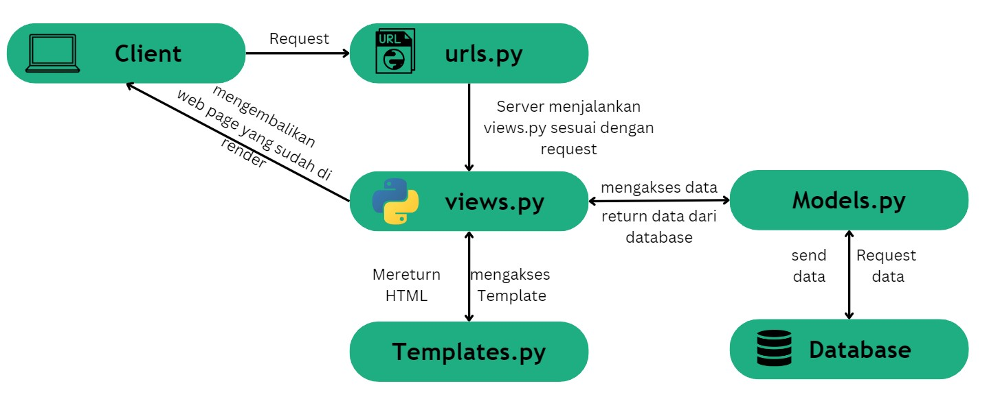

# Ndata
## Tugas 2 PBP Ganjil 23/24

Checklist untuk tugas ini adalah sebagai berikut.

- [X] Membuat sebuah proyek Django baru.
- [x] Membuat aplikasi dengan nama main pada proyek tersebut.
- [x] Melakukan routing pada proyek agar dapat menjalankan aplikasi main.
- [x] Membuat model pada aplikasi main dengan nama Item dan memiliki atribut wajib sebagai berikut.
		name sebagai nama item dengan tipe CharField.
		amount sebagai jumlah item dengan tipe IntegerField.
		description sebagai deskripsi item dengan tipe TextField.
- [X] Membuat sebuah fungsi pada views.py untuk dikembalikan ke dalam sebuah template HTML yang menampilkan nama aplikasi serta nama dan kelas kamu.
- [X] Membuat sebuah routing pada urls.py aplikasi main untuk memetakan fungsi yang telah dibuat pada views.py.
- [X] Melakukan deployment ke Adaptable terhadap aplikasi yang sudah dibuat sehingga nantinya dapat diakses oleh teman-temanmu melalui Internet.
- [X] Membuat sebuah README.md yang berisi tautan menuju aplikasi Adaptable yang sudah di-deploy, serta jawaban dari beberapa pertanyaan berikut.

Tautan menuju link adaptable yang telah di deploy [Ndata](https://ndata.adaptable.app/)

## Pertanyaan dan jawaban
**Jelaskan bagaimana cara kamu mengimplementasikan checklist di atas secara step-by-step (bukan hanya sekadar mengikuti tutorial).**
**Membuat sebuah proyek Django baru**
1. Membuat sebuah Git dan Direktori lokal dengan nama ```Ndata``` 
2. Membuat virtual environment (venv) python untuk mengisolasi python yang digunakan pada proyek ini, mengaktifkan venv dengan memasukkan ```env\Scripts\activate.bat``` pada cmd di direkotori ```Ndata```
3. Membuat file ```requirements.txt``` yang berisi *depedencies* yang dibutuhkan pada proyek ini
4. Install *Depedencies* tadi dengan ```pip intall -r requirements.txt```, lalu membuat proyek django dengan ```django-admin startproject Ndata``` 
5. Membuka ```settings.py```, pada ```ALLOWED_HOST``` jadikan ```["*"]```
6. Mengecek apakah django sudah benar terinstall dengan ```python manage.py runserver```, lalu membuka http://localhost:8000. Jika tidak memunculkan error, maka proyek django berhasil 
7. Nonaktifkan server dengan ```CTRL + C``` dan matikan venv dengan ```deactivate```

**Membuat aplikasi dengan nama main pada proyek tersebut.**
1. Masuk kembali ke mode venv dengan  ```env\Scripts\activate.bat```
2. jalankan ```python manage.py startapp main``` untuk membuat folder baru bernama ```main```
3. pada ```settings.py```, menambahkan ```main``` pada ```INSTALLED APPS```

**Melakukan routing pada urls.py di main.**
1. Membuat file ```urls.py``` pada direktori ```main``` 
2. menambahkan kode ini pada ```urls.py```


**Membuat model pada aplikasi main dengan nama Item dan atribut.**
1. Buka file ```models.py``` pada ```main```
2. Import ```from django.db import models```
3. lalu tambahkan 
4. lakukan migrasi model dengan ```python manage.py make migrations```, setelahnya lakukan ```python manage.py migrate```

**Membuat sebuah fungsi pada views.py untuk dikembalikan ke dalam sebuah template HTML**
1. Buka file ```views.py``` pada ```main```
2. Import ```from django.shortcuts import render```
3. Lalu tambahkan 

**Melakukan routing pada urls.py di folder utama proyek.**
1. Membuka file ```urls.py``` pada direktori ```Ndata``` 
2. Menambahkan import ```include ``` dari ```django.urls```
3. pada ```urlspatterns``` menambahkan ```path('main/',include('main.urls')),```.

**Melakukan deployment ke Adaptable**
1. Login adaptable.io menggunakan github, lalu pilih "New App" dan "Connect an Existing Repository" kemudia pilih "All Repository".
2. Pilih repository Ndata, lalu gunakan branch main untuk *deployment*
3. Gunakan template "Python App Template"  dan "PostgreSQL" sebagai basis datanya
4. Sesuaikan Versi python (gunakan python --version di cmd untuk mengcek versi yang digunakan)
5. Mengisi start command dengan ```python manage.py migrate && gunicorn Ndata.wsgi```.
7. Tentukan nama aplikasi yang akan menjadi domain *website*
8. Centang "HTTP Listener on PORT" dan klik "Deploy App" untuk memulai proses deploy aplikasi

**Buatlah bagan yang berisi request client ke web aplikasi berbasis Django beserta responnya dan jelaskan pada bagan tersebut kaitan antara urls.py, views.py, models.py, dan berkas html.**

Di web app yang berbasi Django, saat client mengirimkan permintaan HTTP, Django akan menggunakan ```urls.py``` untuk mencari dan menentukan views yang sesuai. pada ```views.py``` akan mengatur logika app, termasuk bagaimana app berinteraksi dengan model yang ada pada ```models.py``` untuk mengakses dan menggunakan data pada database. Data yang diperlukan akan dikumpulkan pada views, dan hasilnya akan dirender pada file HTML. file HTML akan mengandung kode HTML dan juga tag template Django untuk memasukkan data yang berasal dari views. setelah proses tersebut selesai, webpage tadi akan dikirim sebagai respon ke client.
```urls.py``` = mengelola routing
```views.py``` = mengatur logika
```models.py``` = mengelola data
```template``` = mengatur tampilan

### **Jelaskan mengapa kita menggunakan virtual environment? Apakah kita tetap dapat membuat aplikasi web berbasis Django tanpa menggunakan virtual environment?**

Virtual Environment (venv) adalah sebuah modul yang membantu memisahkan depedencies yang diperlukan suatu proyek yang berbeda dengan membuat Virtual Environment python yang terisolasi dari Base Environment. 

Kita menggunakan virtual environment untuk memisahkan dan mengisolasi *depedencies* yang digunakan pada proyek ini dari base environment python yang akan menghindari terjadinya konflik saat mengerjakan berbagai projek yang memiliki *depedencies* yang berbeda. Ketika ada perbedaan versi python ketika proyek dikerjakan oleh orang yang berbeda, proyek tetap dapat berjalan dengan aman karena konfigurasi virtual environment yang digunakan akan memiliki versi python yang sama

### **Jelaskan apakah itu MVC, MVT, MVVM dan perbedaan dari ketiganya.**
MVC (Model-View-Controller), MVT (Model-View-Template), dan MVVM (Model-View-ViewModel) adalah pola arsitektur perangkat lunak yang sering digunakan dalam proses pengembangan aplikasi untuk memisahkan berbagai komponen aplikasi dan membuatnya lebih terstruktur dan tidak terjadi konflik antar komponen. Pada dasarnya mereka memiliki konsep yang tidak jauh berbeda, namun penggunaan mereka memiliki konteks dan cara pengorganisasian komponen-komponennya.

**Model View Controller (MVC)**
|Model|View|Controller|
|---|---|---|
|Komponen yang mengatur data pada aplikasi. Komponen inilah yang mengurus akses dan manipulasi data, baik dari suatu database atau sumber lainnya. selain itu Model juga menentukan logika yang dimiliki aplikasi, seperti perhitungan dan validasi data.|komponen yang menangani tampilan yang dilihat oleh pengguna saat berinteraksi dengan aplikasi. komponen ini bertugas mengambil data dari Model dan ke tampilan.|Komponen yang mengatur hubungan Model dan View. komponen ini menangani permintaan pengguna, lalu memprosesnya, dan akan mengirimkannya ke Model untuk memperbarui atau mengambil data yang diperlukan.|

**Model View Template (MVT)**
|Model|View|Template|
|---|---|---|
|Sama seperti Model pada MVC, Komponen inilah yang mengatur data pada aplikasi dan menentukan logika yang digunakan aplikasi.|Komponen yang mengatur logika tampilan pada konsep MVT, mengontrol data yang berasal dari Model untuk ditampilkan ke user.|Komponen yang bertanggung jawab untuk mengatur tampilan pengguna, template pada django digunakan sebagai tempat merancang tampilan yang akan ditampilkan pada halaman web yang menggabungkan data dari Model agar dapat dilihat pengguna.|

**Model View ViewModel (ViewModel)**
|Model|View|ViewModel|
|---|---|---|
|Sama seperti Model pada MVC, dan MVT. Nantinya Model dan ViewModel pada MVVM.|Komponen yang bertanggung jawab untuk menampilkan tampilan dan memberi tahu ViewModel tentang tindakan pengguna. View pada MVVM berfungsi sebagai penampil yang pasif yang hanya menampilkan data dan tidak ada logika aplikasi.|Komponen yang bertindak sebagai penghubung antara Model dan View. ViewModel mengubah data yang berasdal dari Model menjadi format yang dapat ditampilkan oleh View dan juga mengatur logika tampilan.|

**Perbedaan MVC, MVT, dan MVVM**

**MVC**
MVC adalah pola desain yang diatur agar digunakan dalam perkembangan berbagai jenis aplikasi di berbagai platform. Pada MVC, Controller memiliki peran yang aktif dalam mengatur Model dan View. MVC terfokus pada pemisahan tugas pada Model yang mengelola data dan logika, View yang mengurus tampilan, dan Controller yang mengatur jalannya MVC, developer harus sering mengelola secara manual pembaruan tampilan setiap kali ada perubahan data.

**MVT**
MVT adalah konsep yang sering digunakan dalam pengembangan web dengan Django yang berbasis Python. Salah satu komponen uniknya adalah Template (Django), yang dikhususkan untuk mengatur tampilan pada halaman web, sedangkan Model dan View sama seperti pada MVC. *framework* ini memiliki alat bawaan untuk mengurus pembaruan tampilan secara otomatis ketika ada perubahan data

**MVVM**
MVVM sering digunakan dalam pengembangan aplikasi yang berbasis *User Interface*(UI), seperti app mobile ataupun desktop. MVVM memiliki fokus untuk memisahkan tugas tampilan dan logika dalam UI, ViewModel bertindak sebagai penghubung antara Model dan View memungkinkan keduanya untuk tetap terpisah dan mengurangi ketergantungan antara keduanya. MVVM mengandalkan sistem pengikatan data (*Data Binding*) untuk secara otomatis memperbarui tampilan ketika ada perubahan pada ViewModel, ini akan mengurangi kode boilerplate yang diperlukan untuk pemabruan tampilan, tetapi jika sistem pengikatan data tersebut sangat kompleks, akan sulit untuk melakukan *debugging* 

# Tugas 3 PBP Ganjil 23/24

 - [x] Membuat input form untuk menambahkan objek model pada app sebelumnya.
 - [x] Tambahkan 5 fungsi views untuk melihat objek yang sudah ditambahkan dalam format HTML, XML, JSON, XML by ID, dan JSON by ID.
 - [x] Membuat routing URL untuk masing-masing views yang telah ditambahkan pada poin 2.
 - [X] Menjawab beberapa pertanyaan berikut pada README.md pada root folder.
	* Apa perbedaan antara form POST dan form GET dalam Django?
	* Apa perbedaan utama antara XML, JSON, dan HTML dalam konteks pengiriman data?
	* Mengapa JSON sering digunakan dalam pertukaran data antara aplikasi web modern?
	* Jelaskan bagaimana cara kamu mengimplementasikan checklist di atas secara step-by-step (bukan hanya sekadar mengikuti tutorial).
- [x] Mengakses kelima URL di poin 2 menggunakan Postman, membuat screenshot dari hasil akses URL pada Postman, dan menambahkannya ke dalam README.md.
- [x] Melakukan add-commit-push ke GitHub.

## **Membuat Input Form untuk menambahkan objek model pada app sebelumnya** 
1. Membuat folder ```templates``` pada root folder, kemudian buat file html ```base.html``` dengan isi
```html

<!DOCTYPE html>
<html lang="en">
    <head>
        <meta charset="UTF-8" />
        <meta
            name="viewport"
            content="width=device-width, initial-scale=1.0"
        />
        
        
    </head>

    <body>
        
        
    </body>
</html>
```

2. Pada ```settings.py``` yang ada pada subdirektori ```Ndata```, pada variabel ```TEMPLATES``` lalu sesuakian kode pada bagian ```DIRS``` menjadi
```py
TEMPLATES = [
    {
        ...
        'DIRS': [BASE_DIR / 'templates'],
        ...
    }
]
```

3. Pada ```main.html``` yang berada pada subdirektori ```templates``` yang berada di dalam direktori ```main```, tambahkan kode
```html


    ...
    //kode html sebelumnya
    ...

```

4. Lalu nyalakan virtual environment dengan ```env\Scripts\activate.bat```

5. Membuat file ```forms.py``` pada direktori ```main``` yang berisi struktur form yang dapat menerima data
```py
from django.forms import ModelForm
from main.models import Product

class ProductForm(ModelForm):
    class Meta:
        model = Product
		fields = ["name", "price", "description"]
```

6. Pada file ```views.py``` pada direktori ```main```, tambahkan beberapa input baru serta buat fungsi ```create_product``` agar data pada form bisa menambahkan data secara otomatis
```py
from django.http import HttpResponseRedirect
from main.forms import ProductForm, Product
from django.urls import reverse
...
def create_product(request):
    form = ProductForm(request.POST or None)

    if form.is_valid() and request.method == "POST":
        form.save()
        return HttpResponseRedirect(reverse('main:show_main'))

    context = {'form': form}
    return render(request, "create_product.html", context)
```


## **Tambahkan 5 fungsi views untuk melihat objek yang sudah ditambahkan dalam format HTML, XML, JSON, XML by ID, dan JSON by ID.**

### **HTML**
1. Pada file ```views.py``` ubah fungsi ```show_main``` menjadi 
```py
def show_main(request):
    products = Product.objects.all()

    context = {
        'name': 'M Pendar Bintang K',
        'class': 'PBP E',
        "app" : "Ndata",
        'npm' : '2206083174',
        'products' : products
    }

    return render(request, "main.html", context)
```
2. Buat file ```create_product.html``` pada folder ```templates``` yang berada di dalam direktori ```main```, fungsi dari file ini adalah menampilkan tampilan form untuk meminta input data
```html
 


<h1>Add New Product</h1>

<form method="POST">
    
    <table>
        {{ form.as_table }}
        <tr>
            <td></td>
            <td>
                <input type="submit" value="Add Product"/>
            </td>
        </tr>
    </table>
</form>


```

3. Pada file ```urls.py``` yang berada di dalam direktori ```main``` tambahkan import ```create_product``` dan tambahkan path url di urlpattern
```py
from main.views import show_main, create_product
...
urlpatterns = [
    ...
    path('create-product', create_product, name='create_product'),
]
``` 

4.  Pada ```main.html``` yang berada pada subdirektori ```templates``` yang berada di dalam direktori main, tambahkan kode di dalam `````` agar bisa menampilkan isi barang yang sudah ditambahkan.
```html
...
<table>
	<tr>
		<th>Name</th>
		<th>Price</th>
		<th>Description</th>
		<th>Date Added</th>
	</tr>

	
		<tr>
			<td>{{product.name}}</td>
			<td>{{product.price}}</td>
			<td>{{product.description}}</td>
			<td>{{product.date_added}}</td>
		</tr>
	
</table>

<h3>Kamu menyimpan {{ total_products }} productsproducts pada aplikasi ini</h3>

<br />

<a href="">
	<button>
		Add New Product
	</button>
</a>
...
```
## **Membuat routing URL untuk masing-masing views yang telah ditambahkan pada poin 2.**
### **XML dan JSON**
1. Buka file ```views.py``` pada direktori ```main```, lalu import ```HttpResponse``` dan ```Serializer```, lalu tambahkan fungsi ```show_xml``` dan ```show_json```
```py
from django.http import HttpResponseRedirect, HttpResponse
from django.core import serializers
***
def show_xml(request):
    data = Product.objects.all()
    return HttpResponse(serializers.serialize("xml", data), content_type="application/xml")

def show_json(request):
    data = Product.objects.all()
    return HttpResponse(serializers.serialize("json", data), content_type="application/json")

***

```
2. Buka file ```urls.py``` pada direktori ```main```, import fungsi ```show_xml``` dan ```show_json``` dan tambahkan routing url ke urlpatterns
```py
from main.views import show_main, create_product, show_json, show_xml,
...
urlpatterns = [
	...
    path('xml/', show_xml, name='show_xml'), 
    path('json/', show_json, name='show_json'), 
]
```
### **XML dan JSON by ID**
1. Buka file ```views.py``` pada direktori ```main```, lalu tambahkan fungsi ```show_xml_by_id``` dan ```show_json_by_id```, kedua fungsi tersebut akan mengembalikan data hasil query dengan format JSOn ataupun XML
```py
from django.http import HttpResponseRedirect, HttpResponse
from django.core import serializers
***
def show_xml_by_id(request, id):
    data = Product.objects.filter(pk=id)
    return HttpResponse(serializers.serialize("xml", data), content_type="application/xml")

def show_json_by_id(request, id):
    data = Product.objects.filter(pk=id)
    return HttpResponse(serializers.serialize("json", data), content_type="application/json")
***

```
2. Buka file ```urls.py``` pada direktori ```main```, import fungsi ```show_xml_by_id``` dan ```show_json_by_id``` dan tambahkan routing url ke urlpatterns
```
from main.views import show_main, create_product, show_json, show_xml, show_json_by_id, show_xml_by_id
...
urlpatterns = [
	...
    path('xml/<int:id>/', show_xml_by_id, name='show_xml_by_id'),
    path('json/<int:id>/', show_json_by_id, name='show_json_by_id'), 
]
```

## **PERBEDAAN form ```POST``` dan form ```GET```**
Dalam Django ada dua metode berbeda dalam pendekatan pertukaran data antara browser dan server web saat mengirim data dari formulir dan html, yaitu POST dan GET. POST digunakan ketika ingin menrigim data yang bersifat sensitif dengan cara yang aman, data tersebut tidak harus terilhat dalam URL, metode ini mengirim data didalam tubuh permintaan HTTP yang mengakibatkan data tidak terlihat oleh pengguna saat proses pengiriman sehingga metode ini tidak cocok untuk di-bookmark. contoh salah satu penggunaannya adalah ketika memasukkan kata sandi. GET mengirim data sebagai bagian dari URL, yang membuat data terlihat pada URL, metode ini cocok untuk operasi yang hanya membaca (*read-only*) sehingga metode ini llebih cocok di-bookmark , seperti pencarian atua pengiriman parameter dalam URL. Selain itu, umumnya metode POST tidak di-cache oleh browser, sehingga pengguna selalu mendapatkan respon yang terbaru dari server. Sementara metode GET dapat di-cache oleh browser, yang akan meningkatkan performa, namun harus berhati-hati dengan data yang mungkin sudah kadaluarsa 

Pemrosesan server juga memainkan peran penting dalam pemilihan metode. Metode POST umumnya digunakan ketika ingin melakukan operasi yang memodifikasi atau menyimpan data di server, seperti menambahkan catatan ke database, mengirim email, atau melakukan tindakan lain yang memengaruhi status server. Sementara metode GET lebih sesuai untuk operasi yang hanya membaca data di server tanpa mengubahnya, seperti pencarian, filtering, atau mengambil data yang sudah ada.

## **PERBEDAAN XML, JSON, dan HTML dalam konteks pengiriman data**
Singkatnya, XML cocok untuk data yang sangat terstruktur dan ketat, JSON cocok untuk data yang lebih sederhana dan efisien dalam aplikasi web, sedangkan HTML adalah bahasa markup yang digunakan untuk membuat tampilan web yang bisa diakses.

XML adalah *markup language* yang digunakan untuk menyimpan dan mengirim data dengan struktur yang ketat. XML menyediakan aturan untuk menentukan jenis data dengan penggunaan tag dan atribut untuk mendifiniskan elemen data. sehingga cocok digunakan untuk pertukaran data yang kompleks dengan validasi data yang ketat. Namun, XML memiliki overhead dalam ukuran file karena strukturnya yang kuat dan parsing XML memerlukan sumber daya yang signifikan

JSOn adalah format penukaran data yang dapat dibaca dengan mudah oleh manusia maupun komputer. JSON menggunakan struktur objek dan array yang lebih simpel dari XML, membuatnya handal dalam pertukaran data yang cepat dan efisien. JSON mendukung berbagai jenis data, termasuk string, integer, object, array, dan boolean, menjadikannya format yang serbaguna untuk pertukaran data antara klien dan server. Namun, JSON tidak memiliki dukungan bawaan untuk definisi skema data yang kuat, sehingga dapat terjadi masalah kompabilitas jika tidak dikelola dengan baik.

HTML adalah *markup language* yang dirancang khusus untuk membuat dan mengatur konten web yang dapat diakses melalui web browser. HTML biasanya tidak digunakan untuk pertukaran data struktural antara aplikasi, tetapi digunakan untuk membuat tampilan dan struktur halaman web dengan kemampuan untuk memasukkan data dalam atribut atau elemen tertentu dengan bantuan JavaScript. HTML berperan sebagai struktur dasar dari semua halaman web modern

## **Mengapa JSON sering digunakan dalam pertukaran data antara aplikasi web modern?**
JSON memiliki format teks ringan dan fleksibilitas atas struktur datanya yang memudahkan pengembang dalam memahami. mengelola, dan merepresentasikan data yang kompleks. Dukungan dari berbagai macam bahasa pemrograman dan platform membuatnya serbaguna, terutama dalam interaksi antar layanan web dan API eksternal. JSON juga menawarkan fitur keamanan yang mengurangi risiko serangan injeksi kode. Dalam pengaplikasian *real-time*, JSON memungkinkan pembaruan data efisien antara klien dan server yang meningkatkan pengalaman pengguna.

## **Screenshot hasil aksek URL dengan menggunakan Postman**
### **XML**

### **XML by ID**

### **JSON**

### **JSON By Id**


# Tugas 4 PBP Ganjil 23/24
 - [x] Mengimplementasikan fungsi registrasi, login, dan logout untuk memungkinkan pengguna untuk mengakses aplikasi sebelumnya dengan lancar.
 - [x] Membuat dua akun pengguna dengan masing-masing tiga dummy data menggunakan model yang telah dibuat pada aplikasi sebelumnya untuk setiap akun di lokal.
 - [x] Menghubungkan model Item dengan User.
 - [x] Menampilkan detail informasi pengguna yang sedang logged in seperti username dan menerapkan cookies seperti last login pada halaman utama aplikasi
 - [X] Menjawab beberapa pertanyaan berikut pada README.md pada root folder (silakan modifikasi README.md yang telah kamu buat sebelumnya; tambahkan subjudul untuk setiap tugas).
	* Apa itu Django UserCreationForm, dan jelaskan apa kelebihan dan kekurangannya?
	* Apa perbedaan antara autentikasi dan otorisasi dalam konteks Django, dan mengapa keduanya penting?
	* Apa itu cookies dalam konteks aplikasi web, dan bagaimana Django menggunakan cookies untuk mengelola data sesi pengguna?
	* Apakah penggunaan cookies aman secara default dalam pengembangan web, atau apakah ada risiko potensial yang harus diwaspadai?
    * Jelaskan bagaimana cara kamu mengimplementasikan checklist di atas secara step-by-step (bukan hanya sekadar mengikuti tutorial).
- [x] Melakukan add-commit-push ke GitHub.

## **Fungsi Registrasi**
1. Buka ```views.py``` dalam subdirektori ```main```. 
2. Import modul :
```python
from django.shortcuts import redirect
from django.contrib.auth.forms import UserCreationForm
from django.contrib import messages  
```
3. Tambahkan fungsi register
```python
def register(request):
    form = UserCreationForm()

    if request.method == "POST":
        form = UserCreationForm(request.POST)
        if form.is_valid():
            form.save()
            messages.success(request, 'Your account has been successfully created!')
            return redirect('main:login')
    context = {'form':form}
    return render(request, 'register.html', context)

```
4. buat file baru pada folder ```templates``` pada subdirekotri ```main```, dengan nama ```register.html```, lalu isi file menjadi
```html



    <title>Register</title>


  

<div class = "login">
    
    <h1>Register</h1>  

        <form method="POST" >  
              
            <table>  
                {{ form.as_table }}  
                <tr>  
                    <td></td>
                    <td><input type="submit" name="submit" value="Daftar"/></td>  
                </tr>  
            </table>  
        </form>

      
        <ul>   
              
                <li>{{ message }}</li>  
                  
        </ul>   
    

</div>  


```
5. Buka ```urls.py``` di subdirektori ```main```, import fungsi register tadi dan tambahkan path url pada ```urlpatterns```
```python
from main.views import register
...
path('register/', register, name='register'),
...
```

## **Fungsi Login**
1. Buka ```views.py``` dalam subdirektori ```main```. 
2. Import modul :
```python
from django.contrib.auth import authenticate, login
```
3. Tambahkan fungsi login_user
```python
def login_user(request):
    if request.method == 'POST':
        username = request.POST.get('username')
        password = request.POST.get('password')
        user = authenticate(request, username=username, password=password)
        if user is not None:
            login(request, user)
            return redirect('main:show_main')
        else:
            messages.info(request, 'Sorry, incorrect username or password. Please try again.')
    context = {}
    return render(request, 'login.html', context)

```
4. buat file baru pada folder ```templates``` pada subdirekotri ```main```, dengan nama ```login.html```, lalu isi file menjadi
```html



    <title>Login</title>




<div class = "login">

    <h1>Login</h1>

    <form method="POST" action="">
        
        <table>
            <tr>
                <td>Username: </td>
                <td><input type="text" name="username" placeholder="Username" class="form-control"></td>
            </tr>
                    
            <tr>
                <td>Password: </td>
                <td><input type="password" name="password" placeholder="Password" class="form-control"></td>
            </tr>

            <tr>
                <td></td>
                <td><input class="btn login_btn" type="submit" value="Login"></td>
            </tr>
        </table>
    </form>

    
        <ul>
            
                <li>{{ message }}</li>
            
        </ul>
         
        
    Don't have an account yet? <a href="">Register Now</a>

</div>



```
5. Buka ```urls.py``` di subdirektori ```main```, import fungsi register tadi dan tambahkan path url pada ```urlpatterns```
```python
from main.views import login_user
...
path('login/', login_user, name='login'),
...
```

## **Fungsi Logout**
1. Buka ```views.py``` dalam subdirektori ```main```. 
2. Import modul :
```python
from django.contrib.auth import logout
```
3. Tambahkan fungsi logout_user
```python
def logout_user(request):
    logout(request)
    return redirect('main:login')
```
4. pada file  ```main.html``` pada folder ```templates``` yang ada di subdirektori ```main```, lalu tambahkan
```html
...
<a href="">
    <button>
        Logout
    </button>
</a>
...
```
5. Buka ```urls.py``` di subdirektori ```main```, import fungsi register tadi dan tambahkan path url pada ```urlpatterns```
```python
from main.views import logout_user
...
path('logout/', logout_user, name='logout'),
...
```

## **Menghubungkan model Item dengan User**
1. Buka ```models.py``` dalam subdirektori ```main```. 
2. Import modul :
```python
from django.contrib.auth.models import User
```
3. Tambahkan potongan kode berikut
```python
class Item(models.Model):
    user = models.ForeignKey(User, on_delete=models.CASCADE)
```
4. pada file  ```views.py``` yang ada di subdirektori ```main```, ubah kode ```create_item``` menjadi
```python
...
def create_item(request):
    form = ItemForm(request.POST or None)

    if form.is_valid() and request.method == "POST":
        item = form.save(commit=False)
        item.user = request.user
        item.save()
        return HttpResponseRedirect(reverse('main:show_main'))

    context = {'form': form}
    return render(request, "create_item.html", context)

...
```
5. ubah fungsi ```show_main``` menjadi:
```python
from main.views import logout_user
def show_main(request):
    items = Item.objects.filter(user=request.user)

    context = {
        'name': request.user.username,
    ...
...
```

6. setelah itu make migrations pada model, jika muncul error saat migrasi model karena *non-nullable field* 'user', isi dengan '1' kemudian isi '1' lagi
7. lakukan migrate

## **Menambahkan Cookies Last_login**
1. pastikan sudah logout dari aplikasi Django
2. buka ```views.py``` pada subdirektori ```main```, dan import:
```python
import datetime
from django.http import HttpResponseRedirect
from django.urls import reverse
```
3. pada fungsi ```login_user```, tambahkan kode menjadi:
```python
...
if user is not None:
    login(request, user)
    response = HttpResponseRedirect(reverse("main:show_main"))
    response.set_cookie('last_login', str(datetime.datetime.now()))
    return response
...
``` 
4. pada fungsi ```show_main``` tambahkan potongan kode berikut pada context
```python
'last_login' : request.COOKIES['last_login'],
```
5. ubah kode pada fungsi ```logout_user``` menjadi berikut:
```python
def logout_user(request):
    logout(request)
    response = HttpResponseRedirect(reverse('main:login'))
    response.delete_cookie('last_login')
    return response
```
6. pada berkas ```main.html``` pada tambahkan kode berikut:
...html
<h5>Sesi terakhir login: {{ last_login }}</h5>
...

## **Apa itu UserCreationForm serta kelebihan dan kekuranngan**
```UserCreationForm``` adalah salah satu formulir yang disediakan pada Django untuk membuat formulir dan dapat menerima input untuk proses pendafataran pengguna seperti username, password, dan informasi tambahan lainnya.

**- Kelebihan**
1. Mudah digunakan, karena Django sudah menyediakan fungsi yang terdefinisi dengan baik yang memudahkan proses pengembangan web untuk mengimplementasi fitur pendaftaran user baru
2. Validasi Otomatis, Form ini sudah mencakup validasi otomatis. Termasuk validasi alamat email dan kekuatan password
3. Integrasi yang mudah, ini karena ```usercreationform``` sudah terhubung otomatis dengan model pengguna django, yang akan otomatis menyimpan data dalam tabel pengguna di database

**- kekurangan**
1. Masih terdapat celah keamanan. Meski sudah ada validasi bawaan, masih ada celah yang belum ditangani. Sehingga developer harus memastikan kembali app nya memiliki perlindungan yang kuat.
2. Kustomisasi yang terbatas. Ini dikarenakan form ini hanya cocok untuk autentikasi sederhana, dan juga sifatnya yang tidak fleksibel membuat developer perlu membuat form sendiri untuk menangani kebutuhan yang lebih kompleks
3. Fitur yang terbatas. jika ingin membuat form pendaftaran yang kompleks, maka akan membutuhkan fitur yang diinginkan secara manual, menambakan ekstensi, ataupun memodifikasi fitur yang ada.

## **Perbedaan antara autentikasi dan otorisasi dalam konteks Django**
**- Autentikasi** adalah proses verifikasi identitas pengguna. Ini untuk memastikan kebenaran informasi pengguna yang memasukkan kredensial selama proses login. Autentikasi berfungsi untuk memastikan hanya user yang valid dan sesuai dengan data yang terdaftar dengan sistem yang dapat mengakses aplikasi. Contohnya adalah proses memeriksa apakah data yang dimasukkan saat login sama dengan data yang terdaftar pada database.

**- Otorisasi** adalah proses program menentukan hak akses dan izin yang dapat dilakukan oleh user yang berhasil proses melakukan autentikasi. Otorisasi berfungsi untuk melindungi informasi dalam aplikasi dari akses yang tidak valid. Contohnya adalah menentukan apakah user memiliki izin untuk melakukan suatu tindakan tertentu dalam aplikasi tersebut.

## **Cookies dalam konteks aplikasi web dan penggunakan cookies untuk mengelola data sesi pengguna di aplikasi Django**
**Cookies** adalah data yang disimpan di sisi klien browser saat pengguna mengunjungi sebuah situs web. Data tersebut menyimpan informasi yang diperlukan untuk mengetahui pengguna, menjaga status login, dan menyimpan preferensi pengguna

Dalam Django, user yang berhasil login ke  akan menerima cookie session dari server. Cookie ini akan mengandung identifikasi unik yang digunakan oleh server untuk mengenali user tertentu. Ketika user pindah melakukan suatu kegiatan pada aplikasi, cookie ini akan disertakan dalam setiap request HTTP yang dikirimkan ke server. 

**Cookies** adalah mekanisme utama dalam "holding state" yang menyimpan informasi session antara klien dan server dalam aplikasi Django

## **Apakah penggunaan cookies aman secara default dalam pengembangan web, atau apakah ada risiko potensial yang harus diwaspadai?**
Jika diimplementasikan dengan benar serta tetap mengikuti standar dan praktik keamanan yang tepat, maka tentu cookies aman untuk digunkan. Namun, tetap ada risiko potensial yang harus diwaspadai agar penggunaan cookies tidak mengancam keamanan dan juga user.
1. Pelacakan melalui cookies. Cookies dapat digunakan untuk melacak aktivitas pengguna si seluruh situs web dan melintasi berbagai domain, data ini bisa digunakan untuk mengumpulkan data perilaku pengguna secara ilegal atau tanpa izin.
2. Keamanan privasi user. Penggunaan cookies yang ditarget untuk pelacakan perilaku user, dapat memunculkan kekhawatiran akan privasi. User akan merasa tidak nyaman jika mereka mengetahui aktivitas online ataupun data pribadi mereka dapat dilacak.
3. Regulasi. Penggunaan cookies harus memathui berbagai persyaratan yang berlaku sesuai dengan daerah digunakannya, termasuk tentang regulasi mengenai memberikan informasi yang jelas tentang apa saja yang cookies simpan dan memberikan opsi kepada user untuk menolaknya.

Implementasi cookies adalah hal yang penting bagi developer dan pemilik situs web, harus mempertimbangkan dampak dari penggunaan cookies pada privasi dan juga hak-hak yang dimiliki oleh user serta mematuhi regulasi yang berlaku 

##**Tugas 5 PBP GANJIL 23/24**

 - [x] Kustomisasi desain pada templat HTML yang telah dibuat pada Tugas 4 dengan menggunakan CSS atau CSS framework (seperti Bootstrap, Tailwind, Bulma) dengan ketentuan sebagai berikut
	* Kustomisasi halaman login, register, dan tambah inventori semenarik mungkin.
	* Kustomisasi halaman daftar inventori menjadi lebih berwarna maupun menggunakan apporach lain seperti menggunakan Card.
 
 - [X] Menjawab beberapa pertanyaan berikut pada README.md pada root folder (silakan modifikasi README.md yang telah kamu buat sebelumnya; tambahkan subjudul untuk setiap tugas).
	* Jelaskan manfaat dari setiap element selector dan kapan waktu yang tepat untuk menggunakannya.
	* Jelaskan HTML5 Tag yang kamu ketahui.
	* Jelaskan perbedaan antara margin dan padding.
	* Jelaskan perbedaan antara framework CSS Tailwind dan Bootstrap. Kapan sebaiknya kita menggunakan Bootstrap daripada Tailwind, dan sebaliknya?
    * Jelaskan bagaimana cara kamu mengimplementasikan checklist di atas secara step-by-step (bukan hanya sekadar mengikuti tutorial).
- [x] Melakukan add-commit-push ke GitHub.


##**Implementasi CSS**
Pada tugas ini, saya menggunakan internal CSS untuk membantu mendesain halaman web. Saya gunakan selector untuk memisahkan dan mengelompokkan mana saja yang akan di *styling* dengan desain yang sama, setelahnya saya menggunakan block ```<style>``` dan styling *seelector* di dalamnya. 
##**Login Page**
```html


<!DOCTYPE HTML>
<head>
    <meta charset="utf-8">
    <meta http-equiv="X-UA-Compatible" content="IE=edge">
    <title>Login</title>
    <meta name="description" content="">
    <meta name="viewport" content="width=device-width, initial-scale=1">
    <link rel="stylesheet" href="">
    <style>
        *{
            font-family: 'Trebuchet MS', 'Lucida Sans Unicode', 'Lucida Grande', 'Lucida Sans', Arial, sans-serif;
            background-color: rgba(250, 249, 249, 0.692);
        }
        .wrap {
            display: flex;
            justify-content: space-between;
            font-size: 20px;
            width: 100%;
            height: 60px;
            box-shadow: 0 7px 15px 0 rgba(10, 0, 0, 0.692);
        }
        .brand {
            display: flex;
            flex-direction: row;
            font-size: 40px;
            padding: 5px;
            color: rgb(18, 135, 119);   
        }
        .login-container{
            display: flex;
            justify-content: center;
            align-items: center;
        }
        h1{
            text-align: center;
            padding: 10px 0 10px 0;
            color: #02A8A8;
        }

        table, ul{
            display: flex;
            align-items: center;
            justify-content: center;
        }

        .btn-login-btn{
            text-align: center;
            color: white;
            background-color: #02A8A8;
            padding: 5px;
            margin: 10px 0 10px 35px;

        }

        .redirect-login{
            text-align: center;
        }
        /* Existing styles for other elements... */

    </style>
</head>
<body>
    <nav class="wrap">
        <div class="brand">{{ app }}</div>

    </nav>

    <div class="login-container">
        <div class = "login">
            <h1>Login</h1>
            <form method="POST" action="">
                
                <table>
                    <tr>
                        <td>Username: </td>
                        <td><input type="text" name="username" placeholder="Username" class="form-control"></td>
                    </tr>
                            
                    <tr>
                        <td>Password: </td>
                        <td><input type="password" name="password" placeholder="Password" class="form-control"></td>
                    </tr>
        
                    <tr>
                        <td></td>
                        <td><input class="btn-login-btn" type="submit" value="Login"></td>
                    </tr>
                </table>
            </form>
        
            
                <ul style="color: red;">
                    
                        <li>{{ message }}</li>
                    
                </ul>
                 
                
            <p class="redirect-login">Don't have an account yet? <a href="">Register Now</a></p>
        
        </div>
    </div>
    
    
    
</body>

```
##**Register Page**
```html



    <title>Register</title>


  
<!DOCTYPE html>

<head>
    <meta charset="utf-8">
    <meta http-equiv="X-UA-Compatible" content="IE=edge">
    <title>register</title>
    <meta name="description" content="">
    <meta name="viewport" content="width=device-width, initial-scale=1">
    <link rel="stylesheet" href="">
    <style> 
        .wrap{
            display: flex;
            justify-content: space-between;
            font-size: 20px;
            width: 100%;
            height: 60px;
            box-shadow: 0 7px 15px 0 rgba(10, 0, 0, 0.692);
        }
        .brand{
            display: flex;
            flex-direction: row;
            font-size: 40px;
            padding: 5px;
            color: rgb(18, 135, 119);   
        }

        h1{
            text-align: center;
            padding: 10px 0 10px 0;
            color: #02A8A8;
        }

        form {
            margin: 20px;
            padding: 20px;
            border: 1px solid ;
            border-radius: 5px;
            background-color: #F5DEA3;
        }

        table {
            width: 100%;
        }

        td {
            padding: 10px;
        }

        input[type="submit"] {
            background-color: #02A8A8;
            border: none;
            padding: 10px 20px;
            border-radius: 5px;
        }

    </style>
</head>
<body>
<div class = "login">
    <nav class = wrap>
        <div class = brand>Ndata</div>
        <div class="logout-button-container" > 

        </div>
    </nav>
    <div class="register-container">
        <h1>Register</h1>  

        <form method="POST" >  
              
            <table>  
                {{ form.as_table }}  
                <tr>  
                    <td></td>
                    <td><input type="submit" name="submit" value="Daftar"/></td>  
                </tr>  
            </table>  
        </form>

      
        <ul>   
              
                <li>{{ message }}</li>  
                  
        </ul>   
    

    </div>
    
</div>  
</body>

```

##**Main Page**
```html




<!DOCTYPE HTML>
<head>
    <meta charset="utf-8">
    <meta http-equiv="X-UA-Compatible" content="IE=edge">
    <title>Ndata</title>
    <meta name="description" content="">
    <meta name="viewport" content="width=device-width, initial-scale=1">
    <link rel="stylesheet" href="">
    <style>
        *{
            font-family: 'Trebuchet MS', 'Lucida Sans Unicode', 'Lucida Grande', 'Lucida Sans', Arial, sans-serif;
            background-color: rgba(250, 249, 249, 0.692);
        }
        .wrap{
            display: flex;
            justify-content: space-between;
            font-size: 20px;
            width: 100%;
            height: 60px;
            box-shadow: 0 7px 15px 0 rgba(10, 0, 0, 0.692);
        }
        .brand{
            display: flex;
            flex-direction: row;
            font-size: 40px;
            padding: 5px;
            color: rgb(18, 135, 119);   
        }
        h2{
            color:#02A8A8;
            text-align: left;
            font-size: 25px;
            margin-top: 10px;
            box-shadow: rgb;
        }
        h4{
            text-align: center;
            font-size: 20px;
        }
        h5{
            color:#02A8A8;
            text-align: center;
            font-size: 15px;
        }
        .logout-button-container {
            display: flex;
            align-items: center; /* Center vertically within .logout-button-container */
            margin-right: 5px;
        }

        .logout-button {
            color: white;
            background-color: #a50808;
            text-align: center;
            padding: 5px;
            /* Add any other styles you want for the Logout button */
        }

        .logout-button:hover {
            background-color: #870606; /* Change the background color on hover */
        }

        table {
            border-collapse: collapse;
            width: 100%;
            border: 1px solid #000;
        }
        th, td {
            border: 1px solid #000;
            padding: 8px;
            text-align: left;
        }

        tr:first-child {
            background-color: #F5DEA3;
        }

        tr {
            background-color: #F5DEA3;
        }

        tr:last-child{
            background-color: #0b8d79;
        }

        .AddItem-button-container {
            display: flex;
            align-items: center; /* Center vertically within .logout-button-container */
            justify-content: center; /* Center horizontally */
            margin: 10px;
        }

        .Add-button{
            color: black;
            background-color: #F5DEA3;
            text-align: center;
            padding: 5px;
        }

        footer {
            position: fixed;
            left: 0;
            bottom: 0;
            width: 100%;
            background-color: white;
            color: #02A8A8;
        }

        .display-btn {
            display: flex; /* Use flexbox to display buttons in a row */
            align-items: center; /* Center buttons vertically if needed */
        }

        .Add-button {
            margin-right: 5px; /* Add a 5px margin between each button */
            background-color: #42E6A4; /* Set the background color for the Add button */
            color: white; /* Set text color to white */
        }

        .Reduce-button {
            margin-right: 5px; /* Add a 5px margin between each button */
            background-color: #F5DEA3; /* Set the background color for the Reduce button */
            color: black; /* Set text color to black */
        }

        .remove-btn {
            background-color: red; /* Set the background color for the Remove button */
            color: white; /* Set text color to white */
        }
        
        footer h5{
            color: black;
        }
        .footer-content p {
            margin: 0;
            padding: 0;
            font-size: 15px;
        }
    </style>
</head>
<body>
    <nav class = wrap>
        <div class = brand>{{ app }}</div>
        <div class="logout-button-container" > 
            <a href="">
                <button class="logout-button">Logout</button>
            </a>
        </div>
    </nav>
    
    <div class="content">
        <h2>Login As :</h2>
        <p>{{ name }}</p>
        
        <table>
            <tr>
                <th>Name</th>
                <th>Price</th>
                <th>Description</th>
                <th>Amount</th>
                <th>Date Added</th>
                <td>Edit Item</td>
            </tr>
            
            
                <tr>
                    <td>{{item.name}}</td>
                    <td>{{item.price}}</td>
                    <td>{{item.description}}</td>
                    <td>{{item.amount}}</td>
                    <td>{{item.date_added}}</td>
                    <td>
                        <div class="display-btn">
                            <form method="POST" action="">
                                
                                <button type="submit" class="Add-button">+</button>
                            </form>
                            <form method="POST" action="">
                                
                                <button type="submit" class="Reduce-button">-</button>
                            </form>
                            <form method="POST" action="" style="display: inline-block;">
                                
                                <button type="submit" class="remove-btn">Delete</button>
                            </form>
                        </div>
                    </td>
                </tr>
            
        </table>
        <div class="AddItem-button-container">
            <a href="">
                <button class="Add-button">
                    Add New Item
                </button>
            </a>
        </div> 
        <h4>Kamu menyimpan {{ total_items }} jenis itemsitems pada aplikasi ini</h4>
    
        <br />
           
    </div>
</body>
<footer>
    <h5>Sesi terakhir login: {{ last_login }}</h5>
    <div class="footer-content">
        <p>Pemograman Berbasis Platform - Tugas</p>
        <p>Credit: {{creator}} - {{class}} - {{npm}}</p>
    </div>
</footer>



```
##**Create_Item**
```html
 


<head>
    <meta charset="utf-8">
    <meta http-equiv="X-UA-Compatible" content="IE=edge">
    <title>register</title>
    <meta name="description" content="">
    <meta name="viewport" content="width=device-width, initial-scale=1">
    <link rel="stylesheet" href="">
    <style> 
        .wrap{
            display: flex;
            justify-content: space-between;
            font-size: 20px;
            width: 100%;
            height: 60px;
            box-shadow: 0 7px 15px 0 rgba(10, 0, 0, 0.692);
        }
        .brand{
            display: flex;
            flex-direction: row;
            font-size: 40px;
            padding: 5px;
            color: rgb(18, 135, 119);   
        }
        h1{
            text-align: center;
            padding: 10px 0 10px 0;
            color: #02A8A8;
        }
        .create-item-container{
            display: flex;
            justify-content: center;
            align-items: center;
        }

        form {
            display: flex;
            justify-content: center;
            align-items: center;
            text-align: left;
            flex-direction: column;
            padding: 20px;
            margin-top: 5px;
        }
        input, textarea {
            width: 300px;
            height: 20px;
            margin: 10px;
            border-radius: 5px;
            border: 1px solid black;
            padding: 7px;
            color: black;
        }

        textarea:last-child {
            width: 300px;
            height: 150px;
            margin: 10px;
            border-radius: 5px;
            border: 1px solid black;
            padding: 7px;
        }
        input[type=submit] {
            width: 300px;
            height: 40px;
            background-color: #02A8A8;
            border: none;
            border-radius: 5px;
            cursor: pointer;
            display: flex;
            justify-content: center;
            align-items: center;
        }
    </style>
</head>

<body>
    <nav class = wrap>
        <div class = brand>Ndata</div>
        <div class="logout-button-container" > 

        </div>
        </nav>
    <div class="create-item-container">
        <div class="create-item">
            <h1>Add New Item</h1>

            <form method="POST">
                
                <table>
                    {{ form.as_table }}
                    <tr>
                        <td></td>
                        <td>
                            <input type="submit" value="Add Item"/>
                        </td>
                    </tr>
                </table>
            </form>
        </div>
        
    </div>   

</body>



```

## Manfaat dari setiap element selector dan waktu yang tepat untuk menggunakannya
### **Universal Selector (*)**
Manfaatnya adalah untuk memilih semua elemen pada halaman tersebut. Ketika kita ingin menerapkan sebuah _style_ ke semua elemen, misalnya untuk mereset margin atau padding, selector inilah yang tepat untuk dipilih supaya lebih rapi kode css kita.

### **Element Selector (contoh : p, h1, div)**
Dengan menggunakan Element Selector, kita dapat menetapkan gaya dasar untuk seluruh elemen dari tipe yang sama di seluruh situs web atau halaman. Misalnya, menggunakan selector p bisa menentukan gaya untuk semua elemen paragraf

### **ID Selector (#)**
ID Selector memungkinkan kita untuk menargetkan elemen berdasarkan atribut id-nya. Keunggulan utama dari ID Selector adalah spesifikitasnya karena setiap ID harus unik dalam halaman. Ini memastikan bahwa style yang diterapkan melalui ID Selector hanya akan diterapkan pada satu elemen spesifik. Ini sangat berguna untuk komponen yang unik dalam halaman, seperti navigasi utama atau header.

### **Class Selector (.)**
Selector ini memungkinkan kita untuk menargetkan satu atau lebih elemen berdasarkan atribut class-nya. Keuntungan dari Class Selector adalah fleksibilitas dan keterulangan. Kita dapat menerapkan class yang sama ke banyak elemen di seluruh halaman atau situs web, memungkinkan pengembang dengan mudah memberikan style konsisten ke sekelompok elemen. Selector ini sangat berguna untuk komponen yang muncul berulang kali atau memiliki variasi, seperti tombol, kotak teks, atau item daftar.

## Jelaskan HTML5 Tag yang kamu ketahui
### **`<header>`**
Tag ini menandai bagian atas atau pembuka dari sebuah halaman atau bagian dari halaman. Ini biasanya berisi elemen seperti logo, judul situs, dan navigasi utama.

### **`<nav>`**
Ini digunakan untuk menandai bagian navigasi dari sebuah halaman, biasanya berisi tautan menuju bagian lain dari situs atau aplikasi web.

### **`<main>`**
Menandai konten utama dari halaman, yang unik dan tidak berulang di berbagai halaman situs.

### **`<article>`**
Digunakan untuk konten yang dapat berdiri sendiri dalam dokumen, seperti postingan blog, berita, atau artikel ilmiah. Konten di dalam `<article>` harus membuat sense meskipun ditempatkan di luar situs.

### **`<section>`**
Mewakili bagian yang berdiri sendiri dalam konteks, sering digunakan untuk membagi bagian-bagian besar konten atau layout.

### **`<footer>`**
Digunakan untuk menandai bagian bawah halaman atau bagian dari halaman. Ini biasanya berisi informasi seperti hak cipta, tautan tambahan, atau kontak.

## Perbedaan antara margin dan padding
Margin dan padding adalah dua properti penting dalam CSS yang mengatur ruang sekitar elemen. Keduanya, meskipun serupa dalam fungsi, memiliki perbedaan kunci dalam aplikasinya. Margin merujuk pada ruang di luar batas elemen, berfungsi sebagai buffer antara elemen dan elemen lain di sekitarnya. Ini tidak mewarisi warna latar belakang dari elemen dan selalu transparan. Selain itu, margin memiliki sifat khusus yang disebut "margin collapsing", di mana margin vertikal dari dua elemen yang berdekatan dapat bertabrakan atau menumpuk. Sebaliknya, padding adalah ruang di antara konten elemen dan batasnya. Berbeda dengan margin, padding mewarisi warna latar belakang dari elemen, memberikan kesan bahwa elemen itu sendiri lebih besar atau lebih luas. Padding tidak bertabrakan seperti margin, sehingga ruang yang ditentukan selalu konsisten. Selanjutnya, ketika menyangkut ukuran total elemen, padding dapat mempengaruhi dimensinya, tergantung pada model kotak yang digunakan. Secara keseluruhan, meskipun margin dan padding keduanya mengatur ruang, mereka beroperasi pada area yang berbeda dari elemen dan memiliki karakteristik unik mereka sendiri.

## Perbedaan antara framework CSS Tailwind dan Bootstrap dan kapan sebaiknya kita menggunakan Bootstrap daripada Tailwind, dan sebaliknya?
Dikenal sebagai framework berbasis komponen, Bootstrap menyediakan serangkaian komponen desain yang telah ditentukan, seperti tombol, kartu, dan navbar, yang dapat dengan mudah disesuaikan dan diintegrasikan ke dalam situs web. Ini memungkinkan pengembangan yang cepat dan konsisten, terutama bagi mereka yang ingin prototipe atau membangun situs web tanpa harus mendesain setiap komponen dari awal. Jika ingin mencari solusi cepat dengan komponen yang siap pakai dan desain yang telah teruji, Bootstrap mungkin adalah pilihan yang tepat. Ini terutama berlaku jika kita kurang familiar dengan desain atau CSS, atau jika ingin membangun aplikasi besar dengan tim yang memerlukan konsistensi desain.

Sebaliknya, Tailwind mengambil pendekatan utilitas-pertama. Alih-alih menyediakan komponen yang telah ditentukan, Tailwind memberi pengembang serangkaian kelas utilitas yang memungkinkan mereka untuk membangun desain kustom dengan cepat langsung di markup. Ini memberikan kebebasan lebih dalam mendesain antarmuka, tetapi juga memerlukan pemahaman yang lebih mendalam tentang desain dan CSS. Jika kita ingin kontrol lebih besar atas estetika situs kita dan tidak keberatan untuk mencari lebih dalam mengenai desain, Tailwind mungkin lebih sesuai. Tailwind cocok bagi mereka yang ingin situs web atau aplikasi mereka memiliki tampilan yang benar-benar unik, atau bagi pengembang yang menghargai pendekatan utilitas-pertama.

##**Tugas 6 PBP GANJIL 23/24**
 - [x]  Mengubah tugas 5 yang telah dibuat sebelumnya menjadi menggunakan AJAX.
	* AJAX GET
	* AJAX POST
    * collectstatic
 
 - [X] Menjawab beberapa pertanyaan berikut pada README.md pada root folder (silakan modifikasi README.md yang telah kamu buat sebelumnya; tambahkan subjudul untuk setiap tugas).
	* Jelaskan perbedaan antara asynchronous programming dengan synchronous programming.
	* Dalam penerapan JavaScript dan AJAX, terdapat penerapan paradigma event-driven programming. Jelaskan maksud dari paradigma tersebut dan sebutkan salah satu contoh penerapannya pada tugas ini.
	* Jelaskan penerapan asynchronous programming pada AJAX.
	* Pada PBP kali ini, penerapan AJAX dilakukan dengan menggunakan Fetch API daripada library jQuery. Bandingkanlah kedua teknologi tersebut dan tuliskan pendapat kamu teknologi manakah yang lebih baik untuk digunakan.
    * Jelaskan bagaimana cara kamu mengimplementasikan checklist di atas secara step-by-step (bukan hanya sekadar mengikuti tutorial).
- [x] Melakukan add-commit-push ke GitHub.

- [x] Melakukan deployment ke PaaS PBP Fasilkom UI dan sertakan tautan aplikasi pada file README.md.

## Implementasi AJAX GET
1. Membuat  fungsi untuk pengembalian data JSON pada views.py yang akan digunakan pada fungsi fetch AJAX. 
```py

def get_item_json(request):
    item = Item.objects.filter(user=request.user)
    item.user = request.user
    return HttpResponse(serializers.serialize('json', item))
```


2. Tambahkan pathnya untuk get-itme pada `urls.py` agar terhubung nantinya
```py
...
      path('get-item/', get_item_json, name='get_item_json'),
```

2. Pada `main.html` dibuat async function pada tag `<script>` yang mengimplementasikan fetch API untuk mengakses fungsi `get_item_json()` yang sebelumnya sudah di buat pada `views.py`.
```py
async function getItems() {
        return fetch("").then((res) => res.json())
    }
```

3. Buat *async function* untuk melakukan refresh data item yang ditampilkan pada halaman secara asinkron dengan memanfaakan async function `getItems()`. Pada function ini, diimplementasikan `await` agar program menunggu pemrosesan pengambilan data pada fungsi `getItems()`. Lalu, panggil function ini pada tag `<script>` agar halaman selalu melakukan refresh terhadap data item ketika halaman dibuka.
```html
async function refreshItems() {
         document.getElementById("item_table").innerHTML = ""
        const items = await getItems()
        const itemCountElement = document.getElementById("itemCount");
        const total_items = items.length; 
        itemCountElement.innerHTML = `Kamu menyimpan ${total_items} ${total_items === 1 ? 'item' : 'items'} pada aplikasi ini`;
        let htmlString =`
        <tr style="text-align: center;">
            <th>Name</th>
            <th>amount</th>
            <th>description</th>
            <th>price</th>
            <th>Edit Item</th>
            
        </tr>
        `
        items.forEach((item) => {
            htmlString += `
            <tr>
                <td>${item.fields.name}</td>
                <td>${item.fields.amount}</td>
                <td>${item.fields.description}</td>
                <td>${item.fields.price}</td>
                <td>
                    <div class="display-btn">
                        <a>
                            <button type="submit" class="minus-btn" onclick="reduceAmount(${item.pk})">-</button>
                        </a>
                        <a>
                            <button type="submit" class="plus-btn" onclick="addAmount(${item.pk})">+</button>
                        </a>
                        <a>
                            <button type="submit" class="remove-btn" onclick="deleteItem(${item.pk})"></button>
                        </a>                                   
                    </div>
                </td>
            </tr>
`        })
        
        document.getElementById("item_table").innerHTML = htmlString
    }
```

4. Tambahkan tag `<table id="item_table>` pada bagian body `main.html` agar tabel yang dibuat pada fungsi di `<script>` akan ditampilkan pada halaman.

## Implementasi AJAX POST
1. Buat terlebih dahulu fungsi untuk menambahkan item dengan AJAX pada `views.py`
```py
@csrf_exempt
def add_item_ajax(request):
    if request.method == 'POST':
        name = request.POST.get("name")
        price = request.POST.get("price")
        amount = request.POST.get("amount")
        description = request.POST.get("description")
        user = request.user

        new_product = Item(name=name, price=price, description=description, amount=amount, user=user)
        new_product.save()

        return HttpResponse(b"CREATED", status=201)
    return HttpResponseNotFound()
```

2. Tambahkan pathnya untuk create_item_ajax pada `urls.py` agar terhubung nantinya
```py
...
    path('create-item-ajax/', add_item_ajax, name='add_item_ajax')
```

3. Tambahkan modal untuk pengisian form pembuatan item dengan AJAX pada body `main.html` dengan memanfaatkan *framework* dari bootstrap dan tambahkan form dengan rincian sesuai dengan attribute dari model Item
```html
<div class="modal fade" id="staticBackdrop" tabindex="-1" aria-labelledby="staticBackdropLabel" aria-hidden="true">
    <div class="modal-dialog">
        <div class="modal-content">
            <div class="modal-header">
                <h1 class="modal-title fs-5" id="staticBackdropLabel">Add New Item</h1>
                <button type="button" class="btn-close" data-bs-dismiss="modal" aria-label="Close"></button>
            </div>
            <div class="modal-body">
                <form id="form" onsubmit="return false;">
                    
                    <div class="mb-3">
                        <label for="name" class="col-form-label">Name:</label>
                        <input type="text" class="form-control" id="name" name="name"></input>
                    </div>
                    <div class="mb-3">
                        <label for="price" class="col-form-label">Price:</label>
                        <input type="number" class="form-control" id="price" name="price"></input>
                    </div>
                    <div class="mb-3">
                        <label for="description" class="col-form-label">Description:</label>
                        <textarea class="form-control" id="description" name="description"></textarea>
                    </div>
                    <div class="mb-3">
                        <label for="amount" class="col-form-label">amount:</label>
                        <input type="number" class="form-control" id="amount" name="amount"></input>
                    </div>
                </form>
            </div>
            <div class="modal-footer">
                <button type="button" class="btn btn-secondary" data-bs-dismiss="modal">Close</button>
                <button type="button" class="btn btn-primary" id="button_add" data-bs-dismiss="modal">Add Item</button>
            </div>
        </div>
    </div>
</div>
```

4. Buatlah button pada 8body* `main.html` yang berfungsi untuk menampilkan modal yang sudah dibuat ketika button tersebut di klik dengan value property data-bs-target sesuai dengan id yang diberikan kepada modal.
```html
<div class="button-container container">
    <button type="button" class="add-btn" data-bs-toggle="modal" data-bs-target="#exampleModal">
        Add Item
    </button>
</div>
```

5. Tambahkan fungsi untuk implementasi penambahan item dengan AJAX POST pada `main.html` didalam tag `<script>` dengan mengimplementasikan fetch API yang akan mengarahkan program untuk menjalankan fungsi `add_item_ajax` yang sudah dibuat pada `views.py` dan melakukan refresh halaman setelah eksekusi fungsi `add_item_ajax` selesai sehingga tampilan daftar item akan terupdate secara asinkron. Lalu, manfaatkan konsep *event-driven programming* untuk membuat button submit yang ada pada modal yang telah dibuat sebelumnya akan memanggil fungsi `addItem` pada `<script>` ketika di klik. Dengan begitu, data-data baru yang diisi pada form yang tercantum pada modal akan menjadi data untuk pembuatan object Item baru pada fungsi `add_item_ajax` di `views.py`.
```js
function addItem() {
        fetch("", {
            method: "POST",
            body: new FormData(document.querySelector('#form'))
        }).then(refreshItems)

        document.getElementById("form").reset()
        return false
    }
...
document.getElementById("button_add").onclick = addItem
```

## Penerapan perintah `collectstatic`
Untuk melakukan perintah `collectstatic` untuk mengumpulkan file static dari setiap aplikasi di proyek ini, cukup dengan melakukan perintah `python manage.py collectstatic` pada terminal atau cmd.

## Perbedaan antara *asynchronous programming* dengan *synchronous programming*
Dalam *synchronous programming*, setiap tugas dieksekusi secara berurutan. Ini berarti, sebuah tugas harus selesai sepenuhnya sebelum tugas berikutnya dapat dimulai. Dalam konteks ini, jika ada suatu tugas yang memerlukan waktu yang lama untuk menyelesaikan, maka ia akan "memblok" atau "menahan" eksekusi tugas-tugas berikutnya hingga tugas tersebut selesai sepenuhnya. Hal ini dapat menyebabkan aplikasi menjadi tidak responsif atau lamban, khususnya dalam kasus di mana ada operasi yang memerlukan waktu yang lama seperti pemanggilan ke database atau permintaan ke server lain.

Sebaliknya, *asynchronous programming* memungkinkan beberapa tugas untuk berjalan secara bersamaan tanpa harus menunggu satu sama lain. Dalam pendekatan ini, sebuah tugas dapat dimulai dan dijalankan di "latar belakang", sementara tugas lainnya tetap berjalan di "latar depan". Ketika tugas di latar belakang selesai, ia bisa memberi tahu sistem atau mengembalikan hasilnya tanpa mengganggu tugas-tugas lain yang sedang berjalan. Pendekatan ini sangat berguna untuk meningkatkan efisiensi dan responsivitas aplikasi, khususnya dalam kasus di mana ada tugas yang memerlukan waktu lama untuk diselesaikan.

Kesimpulannya, perbedaan utama antara kedua pendekatan ini terletak pada cara mereka menangani eksekusi tugas. _Synchronous programming_ mengantri tugas dan menjalankannya satu per satu, sedangkan *asynchronous programming* memungkinkan tugas-tugas untuk berjalan secara paralel, meningkatkan efisiensi dan kinerja aplikasi.

## Pengertian dan contoh dari penerapan paradigma *event driven programming*
Event-driven programming adalah paradigma pemrograman di mana alur eksekusi program ditentukan oleh peristiwa tertentu, seperti tindakan pengguna (misalnya, klik mouse atau ketukan keyboard) atau respons dari sistem lain. Dalam konteks pengembangan web, event-driven programming sering diterapkan untuk menangani interaksi pengguna dengan halaman web. Dalam program saya, contoh penerapan paradigma *event-driven programming* terdapat pada `main.html` adalah
```html
<button type="submit" class="plus-btn" onclick="addAmount(${item.pk})">+</button>
```
Pada kode diatas button diterapkan event-driven programming karena ada tambahan property onclick yang membuat button akan mentrigger berjalannya fungsi addAmount() yang ada didalam tag `<scripts>`.

## Penerapan *asynchronous programming* pada AJAX
Dalam program saya, ada beberapa penerapan dari *asynchronous programming*, khususnya dalam penggunaan AJAX. Asynchronous programming memungkinkan eksekusi kode tanpa harus menunggu operasi tertentu (seperti permintaan jaringan) selesai. Sebaliknya, program dapat melanjutkan eksekusi dan merespons hasil dari operasi tersebut ketika siap. Berikut adalah contoh penerapan *asynchronous programming* pada AJAX.

**1. getItems()**
```js
async function getItems() {
    return fetch("").then((res) => res.json())
}
```
Fungsi `getItems()` menggunakan kata kunci async, menandakan bahwa fungsi tersebut bersifat asinkron. Di dalamnya, Fetch API digunakan untuk mengambil data produk. Karena Fetch API mengembalikan promise, saya menggunakan metode .then() untuk mengambil respons dalam format JSON setelah permintaan selesai.

**2. refreshItems()**
```js
async function refreshItems() {
    ...
    const items = await getItems()
    ...
}
```
Di sini, fungsi `refreshItems()` juga bersifat asinkron. Kata kunci `await` digunakan untuk menunggu hasil dari fungsi `getItems()`. Program tidak akan melanjutkan sampai data yang diperlukan telah diambil.

## Perbandingan antara Fetch API dan library jQuery
Fetch API adalah antarmuka pemrograman aplikasi yang disediakan oleh browser modern untuk melakukan permintaan jaringan. Fetch API memungkinkan developer untuk melakukan permintaan HTTP dan mengendalikannya dengan cara yang lebih fleksibel dan modular. Dibandingkan dengan metode tradisional seperti XMLHttpRequest, Fetch API menawarkan sintaks yang lebih bersih dan mudah dibaca, serta dukungan penuh untuk konsep pemrograman modern seperti Promises dan async/await. Selain itu, Fetch API secara murni berfungsi untuk permintaan jaringan dan tidak memiliki fitur tambahan lainnya.

Di sisi lain, jQuery adalah library JavaScript yang dirancang untuk memudahkan manipulasi DOM, penanganan event, animasi, dan tentu saja, permintaan jaringan melalui Ajax. Meskipun jQuery memiliki fungsi Ajax yang memungkinkan developer untuk melakukan permintaan jaringan, fungsi tersebut hanyalah salah satu dari banyak fitur yang ditawarkan oleh library ini. Dalam hal sintaks, metode Ajax di jQuery umumnya lebih sederhana dan lebih mudah bagi pemula untuk dipahami dibandingkan dengan Fetch API, namun mungkin tidak sefleksibel. Sebagai catatan, jQuery telah ada jauh lebih lama daripada Fetch API, sehingga pada masanya, jQuery menjadi salah satu solusi utama untuk permintaan jaringan di web.

Dalam konteks murni mengenai AJAX, Fetch API tampaknya menjadi pilihan yang lebih unggul untuk proyek-proyek modern. Alasan utamanya adalah Fetch API menyediakan sintaksis yang lebih modern dan bersih, memberikan kontrol yang lebih detail terhadap permintaan, dan secara inheren lebih ringan tanpa beban fitur tambahan yang tidak diperlukan. Namun, bukan berarti jQuery tidak memiliki relevansinya. jQuery dalam pengembangan web memberikannya kelebihan dalam hal kompatibilitas dengan browser-browser lama. Dalam situasi di mana kompatibilitas ini menjadi krusial, atau di proyek-proyek yang sudah mendalam dalam penggunaan jQuery dan fitur-fiturnya yang lain, tetap menggunakan jQuery untuk AJAX mungkin adalah pilihan yang masuk akal.